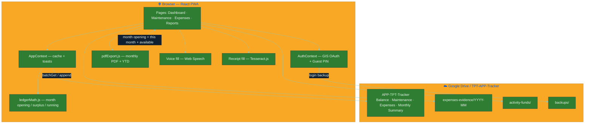
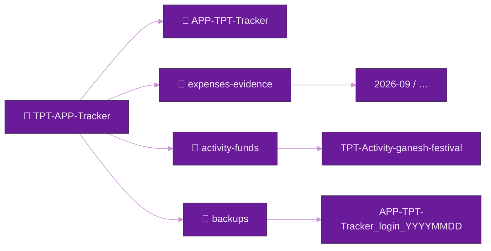
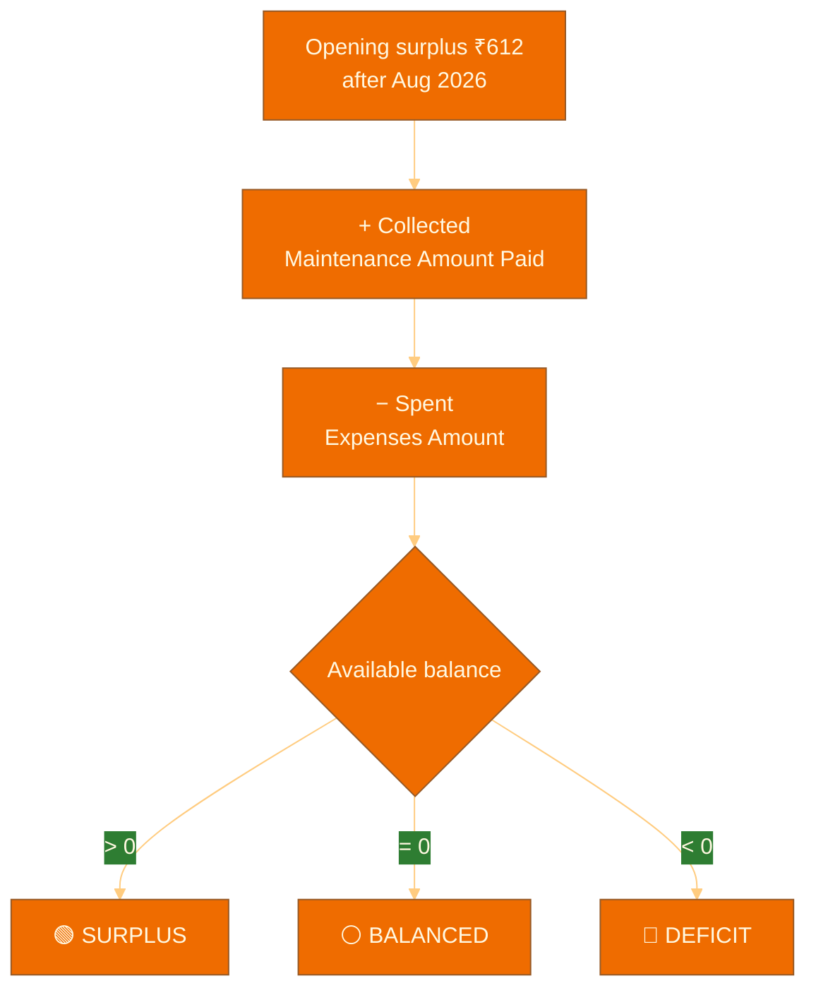
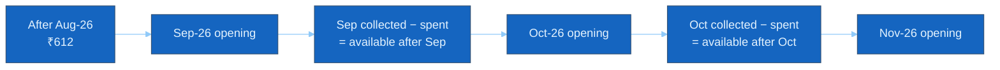
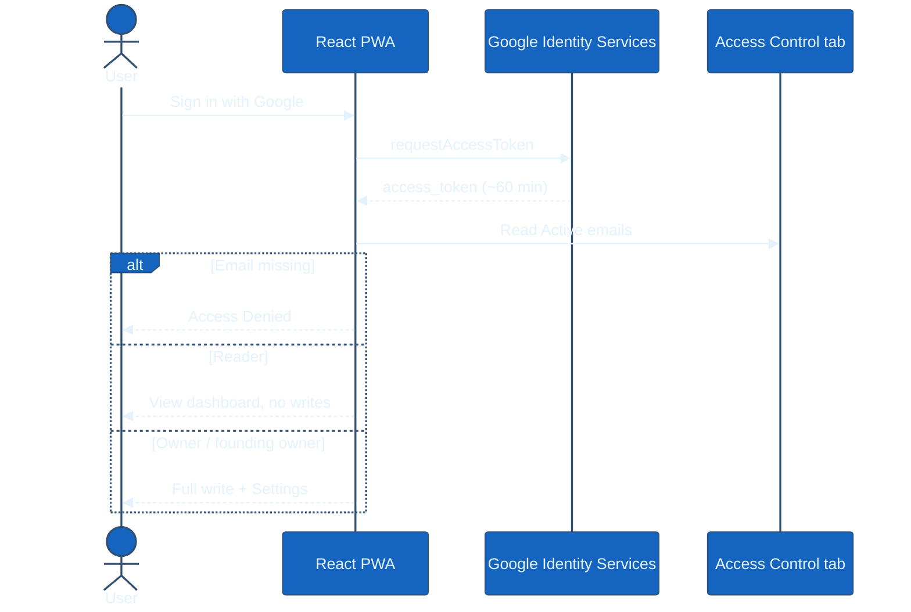
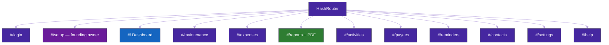
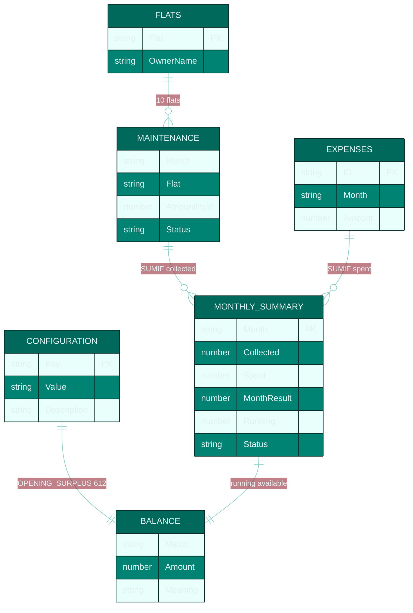

# Architecture — The Pride of Tirumala Expense Tracker

**One Google Sheet. One Drive folder. Books from Sep 2026. Opening surplus ₹612 after Aug 2026 (Sep-26 opening; later months carry the previous available).**

Stack: React 19 · Vite 8 · Google Sheets API v4 · Google Drive API v3 · Google Identity Services · jsPDF · html2canvas · Web Speech API · Tesseract.js

---

## 1. High-level system

The app has **no backend**. The browser talks to Google APIs with a short-lived OAuth token. `APP-TPT-Tracker` is the cash book.



---

## 2. Drive layout



---

## 3. Cash-book math (source of truth)

Opening surplus **₹612** is cash in hand **after August 2026**. It is typed on Configuration as `OPENING_SURPLUS`. That is **September’s opening**, not a figure that repeats on every monthly report.

The **Balance** tab is the whole-books position:

```
Available (Balance tab) = 612 + all Amount Paid − all Expense amounts
```

Each **month** on Monthly Summary and on the report is:

```
This month = collected this month − spent this month
Month opening = ₹612 for Sep-26, else the previous month’s available
Available after this month = month opening + collected − spent
Status = SURPLUS if > 0, DEFICIT if < 0, BALANCED if 0
```

`ledgerMath.js` (`monthOpening`, `pdfMoneySummary`) uses the same rules as the sheet formulas.





A treasurer who never opens this website can still see surplus or deficit on the **Balance** tab. A monthly PDF’s first card is **available after the previous month**.

---

## 4. Authentication and access



| Role | Drive share | App writes |
|------|-------------|------------|
| Founding owner | Writer | Always Owner. May create `APP-TPT-Tracker`. Cannot be removed. |
| Owner (granted) | Writer | Financial writes |
| Reader (default) | Viewer | Read only |
| Guest PIN | None | Cached dashboard only, 24h, this device |

Max 20 users, max 2 owners.

---

## 5. React routes



---

## 6. Workbook tabs



---

## 7. Monthly report (screen, PDF, image)

The first card is **Opening surplus** or **Opening deficit** — cash in hand **after the previous month**. Sep-26 uses ₹612 (after Aug-26). Oct-26 uses whatever was left after Sep.

Every monthly PDF / on-screen report prints:

1. Opening surplus or deficit (brought forward after the previous month)  
2. Collected this month · spent this month  
3. This month SURPLUS / DEFICIT / BALANCED (collected − spent)  
4. Available after this month (opening + collected − spent)  
5. Year to date (chart + table)  
6. Notes, Franklin water quote, volunteer disclaimer — **The Google Sheet is the source of truth**  
7. Watercolor digitally verified stamp (apartment name on an inner circular arc, month inside). If the page is tight, the stamp overlaps the last notes — it does not start a blank page  

Footer on every PDF page: apartment · Monthly Report · treasurer · president · page number.

Do not use the word *society* in resident-facing report copy. Do not print `APP-TPT-Tracker` on the report.

---

## 8. Performance

| Area | How |
|------|-----|
| Dashboard | One `values.batchGet` for Configuration, Maintenance, Expenses, Reminders, Contacts, Flats, Monthly Summary |
| Money | Pure `ledgerMath` — no second Live Summary pass |
| PDF font | Noto Sans cached once per session |
| PWA | Google APIs `NetworkOnly`; vendor / icons / pdf code-split |
| Writes | `withWriteAuth` + Access Control, not UI hiding alone |

---

## 9. Security

- `sanitizeForSheet()` strips leading `= + - @` before every typed cell  
- Tokens stay in `sessionStorage` (no stored refresh token)  
- CSP + `X-Frame-Options: DENY`  
- Readers cannot write even if Drive leftover is Writer  
- Private copies owned by a non-founder are ignored  

---

## 10. Local CSV proof

`npm run workbook:csv` and `src/utils/workbookCsv.test.js` write `test-fixtures/APP-TPT-Tracker/*.csv` and evaluate the same ledger as the live sheet. Sep-26 sample: collected ₹25,500, spent ₹14,400, available after Sep ₹11,712 surplus (opening ₹612). Oct-26 sample opens at ₹11,712, is a deficit month, and ends with ₹6,712 still in surplus.

See `AGENTS.md` and `llms.txt` for agent-facing rules.
