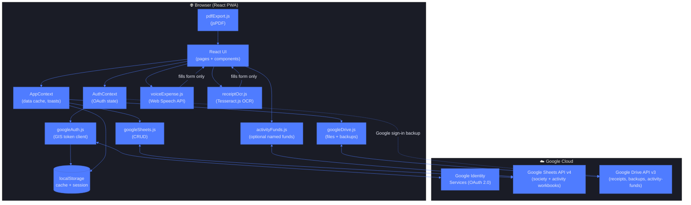
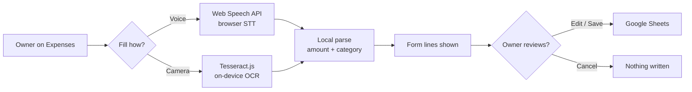
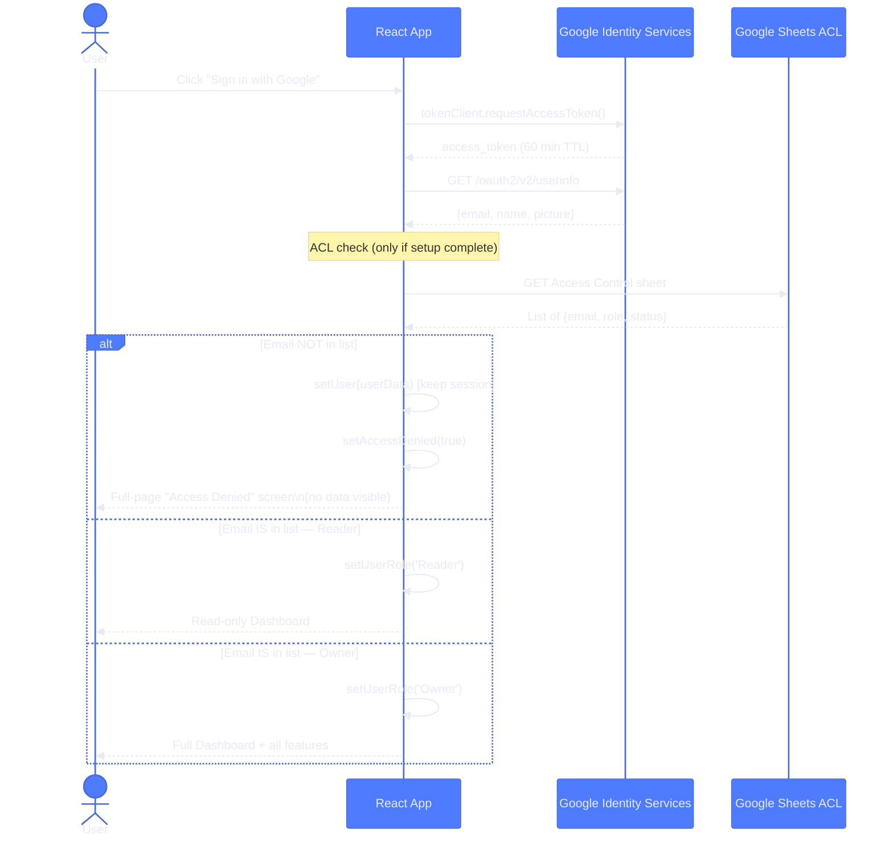
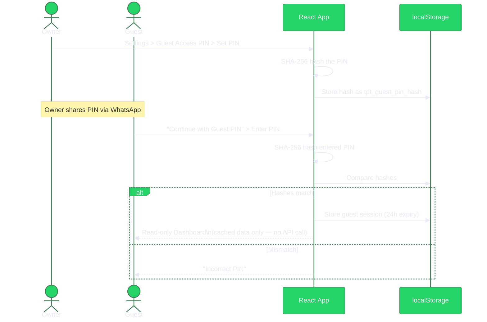
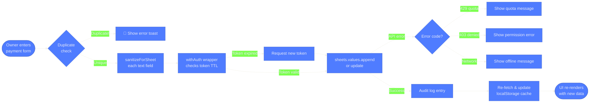
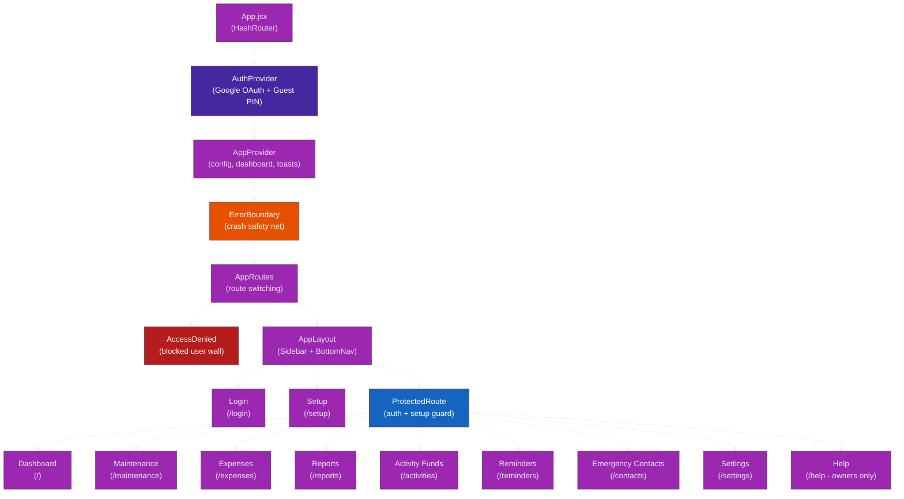
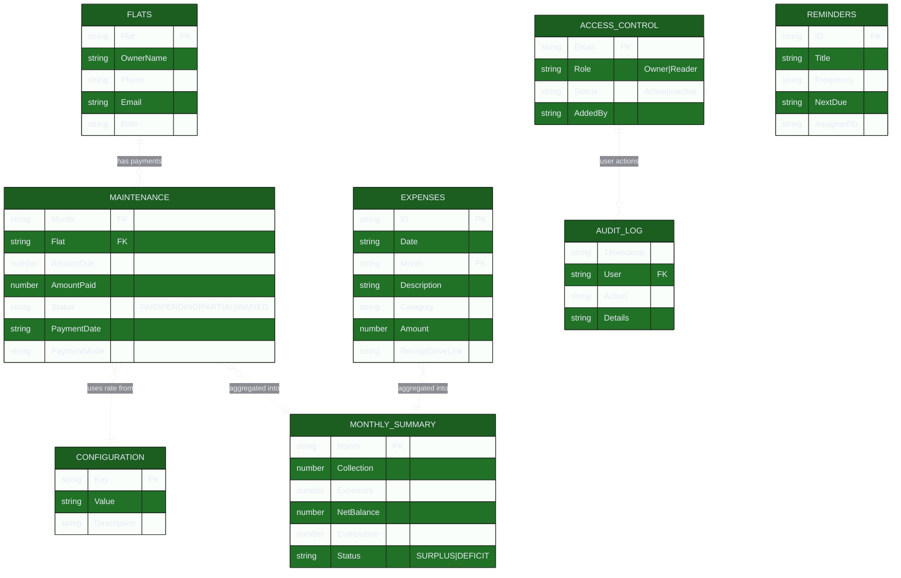
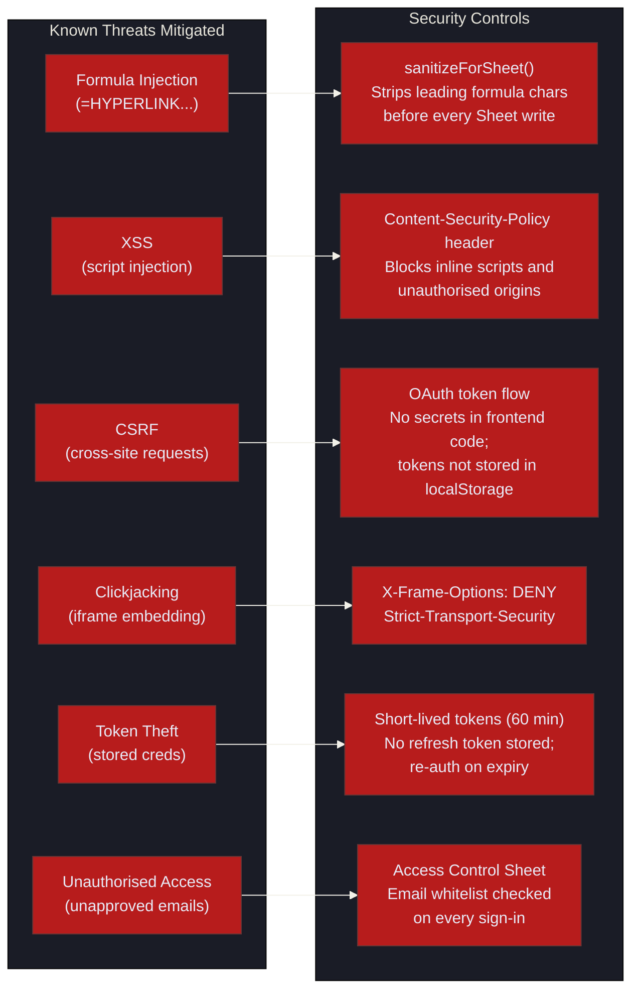

# TPT Apartment Expense Tracker — Architecture & Code Explanation

> **The Pride of Tirumala (TPT)** — A Progressive Web App for managing apartment maintenance finances.  
> Stack: React 19 · Vite 8 · Google Sheets API v4 · Google Drive API v3 · Google Identity Services (OAuth 2.0) · jsPDF · Web Speech API · Tesseract.js  
> Architecture PNG: `docs/architecture.png`

---

## 1. High-Level Architecture

The app has **no backend server**. All data is stored in a Google Sheet in the Owner's Google Drive.
The browser talks directly to the Google APIs using short-lived OAuth 2.0 access tokens.



---

## 1b. Free on-device helpers (not paid AI)

These are **not** ChatGPT / Gemini / cloud models. Nothing from the receipt or spoken sentence is sent to an AI vendor. The user must review the form and tap Save.

| Helper | What it is | How it is used | Limits |
|--------|------------|----------------|--------|
| **Web Speech API** (`voiceExpense.js`) | Browser speech-to-text (Chrome / Safari / Edge). Free, built into the browser. | Owner taps **Fill with voice**, says e.g. `watchman salary 12000 and electricity 2400`. Local regex maps amount, category aliases, and payment mode. | Needs a microphone and a supporting browser. Hindi / noisy rooms often mis-hear amounts. Does not work well in WhatsApp in-app browsers. Never auto-submits. |
| **Tesseract.js v5** (`receiptOcr.js`) | Open-source OCR engine (`eng` traineddata) running **in the browser**. Free, no API key. | Owner taps **Fill from camera**, photo stays on the device while Tesseract reads printed text. Largest rupee figure and category words are suggested. | Slow on older phones (first load downloads worker + language data). Handwriting, crumpled bills, and low light fail often. Dates can be wrong (DD/MM vs MM/DD). First-load cache can be several MB. Never auto-submits. |
| **Local parsers** | Small JavaScript (`parseOneExpense`, `parseReceiptText`). | Split on “and / then / also”; detect ₹ / Rs / category aliases. | Only understands phrases we coded. “twelve thousand” (words) is not parsed. |



---

## 2. Authentication & Authorisation Flow

The app implements a **two-layer security model**:

| Layer | What it does |
|-------|-------------|
| **Google OAuth 2.0** | Proves the user's identity (who they are) |
| **Access Control Sheet** | Decides if that identity is allowed (what they can do) |



### Guest PIN Flow (no Google account needed)



---

## 3. Data Flow — How a Payment is Recorded



---

## 4. React Component Tree



---

## 5. Google Sheet Structure

The Google Sheet is the **single source of truth**. The app never has its own database.



---

## 6. Security Model



### What is formula injection and why does it matter?

Google Sheets evaluates any cell that starts with `=`, `+`, `-`, or `@` as a formula.
If an attacker types `=HYPERLINK("https://phishing.com","Click me")` into the
Description field of an expense and the app writes it unsanitized, everyone who
opens the sheet sees a clickable phishing link.

Our fix in `sanitizeForSheet()`:
```javascript
// Strip any character that Google Sheets treats as a formula prefix
return str.replace(/^[=+\-@\t\r]+/, '').trim();
```

---

## 7. Key Design Decisions

### 7.1 No Backend = No Database
The entire app is a static HTML/JS bundle deployed to Azure Static Web Apps or
GitHub Pages. There is no Node.js/Python server. Google Sheets IS the database.
This means:
- Zero server costs
- Zero DevOps maintenance
- Human-readable data (anyone can open the sheet)
- Limitation: all computation happens client-side; no server-side validation

### 7.2 HashRouter (not BrowserRouter)
GitHub Pages does not support server-side routing. `/#/maintenance` works because
the browser never sends the hash fragment to the server. Azure Static Web Apps is
configured with `navigationFallback` to handle direct URL access.

### 7.3 Short-Lived OAuth Tokens, Never Stored as Refresh Tokens
Google Identity Services (GIS) issues access tokens valid for ~60 minutes.
We deliberately do NOT request or store a refresh token. The token is kept in
`window.gapi.client`'s in-memory state only. The serialized token in localStorage
(`tpt_user_data`) contains the access token and expiry — on next visit, if the
token has expired, the user is asked to sign in again. This reduces the impact of
localStorage theft.

### 7.4 ErrorBoundary
A React class component wraps all page routes. If any page component throws an
unhandled JS exception (e.g., null dereference, failed JSON parse), the error
boundary catches it and shows a friendly "Try Again" screen instead of blanking
the entire app.

### 7.5 Cached Dashboard for Guest Users
Guest PIN users have no Google OAuth token, so they cannot call the Sheets API.
When an Owner loads the Dashboard, the full data set is serialised and stored in
`localStorage` under `tpt_cached_dashboard`. Guest users read this cache. This
means guests always see a snapshot — not live data.

---

## 8. Local Development Setup

```bash
# 1 — Install dependencies
cd C:\Learning\ApartmentApp-TPT\AppartmentApp
npm install

# 2 — Start dev server (hot-reload)
npm run dev
# Open: http://localhost:5173/AppartmentApp/

# 3 — Production build
npm run build

# 4 — Preview production build locally
npm run preview
```

**Node.js requirement:** `>= 22.0.0` (see `.nvmrc`)

---

## 9. Deployment

| Platform | How |
|----------|-----|
| **GitHub Pages** | Push to `main` → GitHub Action builds and deploys automatically |
| **Azure Static Web Apps** | Connected to GitHub; auto-deploys on push; `staticwebapp.config.json` provides CSP and routing rules |

The `base` path in `vite.config.js` is `/AppartmentApp/` so both platforms serve
the app at `https://domain/AppartmentApp/`.

---

## 10. File Map

```
src/
├── App.jsx                    Root router + ErrorBoundary
├── main.jsx                   React DOM entry point
├── config/
│   └── constants.js           All hardcoded values (flat numbers, sheet names, etc.)
├── contexts/
│   ├── AuthContext.jsx        Google OAuth + Guest PIN state
│   └── AppContext.jsx         Dashboard data, toasts, userRole
├── services/
│   ├── googleAuth.js          GIS token client, script loader, token refresh
│   ├── googleSheets.js        All Google Sheets CRUD (the "backend")
│   ├── googleDrive.js         Folder/file management, backups of APP and LIVE
│   ├── liveSheetSetup.js      Founding owner creates The Pride of Tirumala-LIVE
│   └── pdfExport.js           Monthly report PDF generation (jsPDF)
├── components/common/
│   ├── AccessDenied.jsx       Full-page wall for blocked users
│   ├── ErrorBoundary.jsx      React error boundary (class component)
│   ├── ProtectedRoute.jsx     Auth + setup + guest guards
│   ├── Tooltip.jsx            InfoBubble component
│   ├── Navbar.jsx
│   ├── Sidebar.jsx
│   └── ...
├── pages/
│   ├── Dashboard.jsx          Financial overview + cached-data guest view
│   ├── Maintenance.jsx        Monthly payment collection
│   ├── Expenses.jsx           Expense log
│   ├── Reports.jsx            PDF generation + quick export
│   ├── Reminders.jsx          Recurring task reminders
│   ├── EmergencyContacts.jsx  WhatsApp-enabled contact directory
│   ├── Settings.jsx           Config + Access Control + Guest PIN
│   ├── Help.jsx               Owner-only guide + Google Sheets deep-dive
│   ├── Payees.jsx             GPay / PhonePe from phone; optional UPI; no invented UPI
│   ├── OldReport.jsx          #/old read-only APP Summary + handover
│   ├── Setup.jsx              Connect The Pride of Tirumala-APP (never create)
│   └── Login.jsx              Google OAuth + Guest PIN entry
├── styles/
│   ├── variables.css          Design tokens (colours, spacing, etc.)
│   ├── index.css              Global styles, buttons, forms, utilities
│   ├── pages.css              Page-specific styles
│   └── animations.css         Keyframe animations
└── utils/
    └── helpers.js             Pure utility functions incl. sanitizeForSheet()
```
