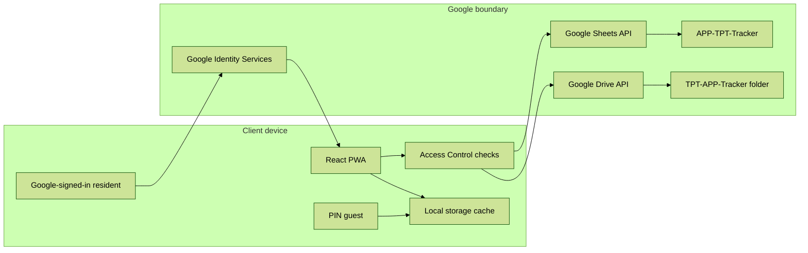
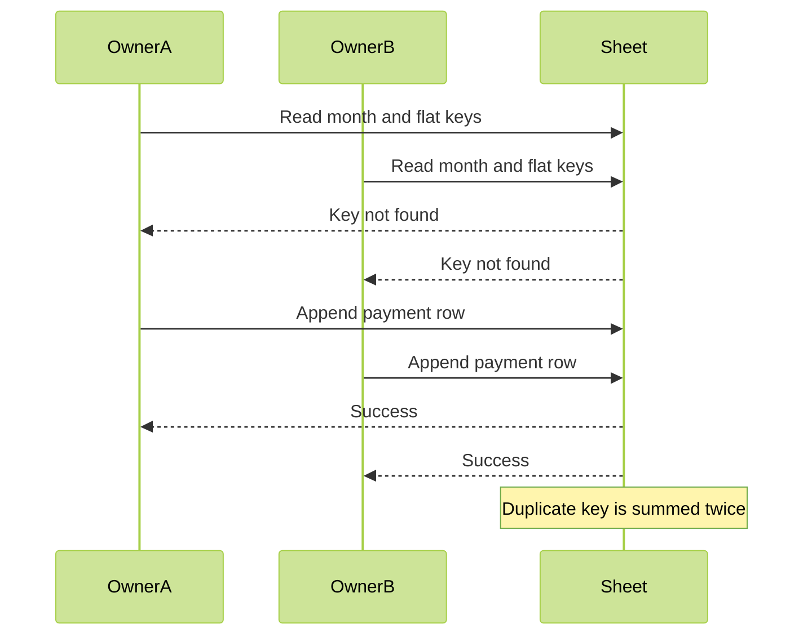
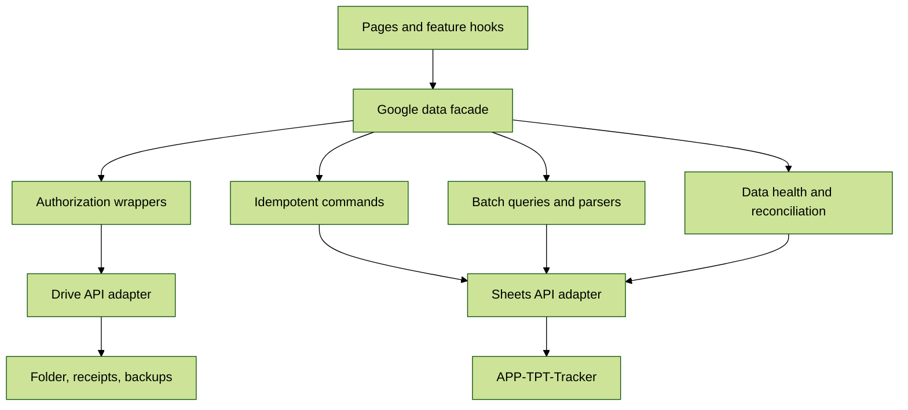
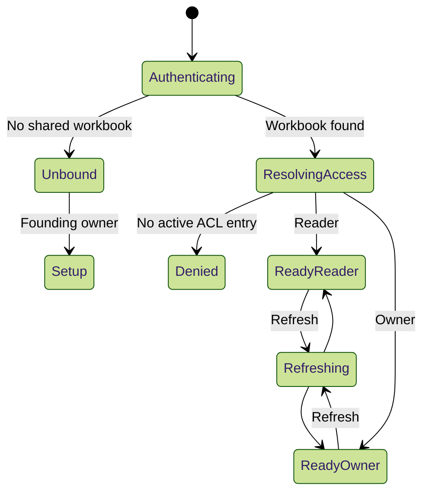
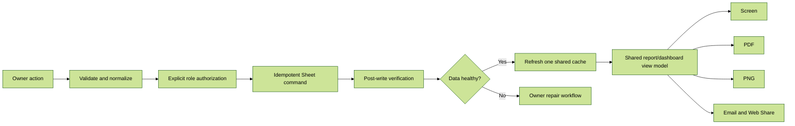

# Repository Improvement Audit

**Project:** The Pride of Tirumala Apartment Expense Tracker
**Audit date:** 12 September 2026
**Scope:** Product, architecture, Google Sheets/Drive, reports, security, performance, CSS/accessibility, testing, operations, and documentation
**Method:** Static repository review, targeted source tracing, existing test review, dependency audit, and cross-checking against `AGENTS.md`, `Architecture.md`, `CLAUDE.md`, and `llms.txt`

## Validation baseline

Fresh local validation on 12 September 2026 produced:

| Check | Result |
|---|---|
| Unit tests | 27 files passed; 107 tests passed |
| Lint | Passed with 17 existing warnings and no errors |
| Production build | Passed; main app 462.65 kB (117.92 kB gzip), PDF 400.45 kB (130.28 kB gzip), image/export dependency 151.43 kB (48.91 kB gzip) |
| Pages validator | Passed: production HTML points to bundled assets |
| Git whitespace check | Passed |

The build sizes are reference measurements, not proof that every listed chunk is downloaded on first load. Network and runtime profiling should determine which optimization work is worthwhile.

## Implementation status (12 September 2026)

Shipped in this change set, without altering cash-book math:

- CI now runs test, lint, build, and `validate:pages` before Pages deploy
- Historical YTD is cut off at the selected month; Web Share names this-month net and available separately
- Sheet and folder permissions stay in sync on add, role change, and remove
- Duplicate maintenance keys and expense fingerprints are detected after write and on Data Health
- Guest cache is a slim snapshot; new PINs are 6–12 digits with attempt throttling
- Guide / Balance / Pending Dues static text is not overwritten on layout refresh
- Expense delete fails clearly when the row is gone; payee updates use the sheet row; phones keep `+91`
- Available cash no longer adds corpus; corpus is shown separately when nonzero
- Dashboard “flats still due” includes partial payments
- Reports, PDF, and image share one wording model; PDF has the fifth “This month” card
- Theme bootstrap moved to `public/theme-init.js`; Azure microphone policy allows voice expenses
- Documentation updated; PWA cache id is `tpt-v70`

Still later (not a silent rewrite): splitting `googleSheets.js` behind a facade, Playwright E2E, month-close workflow, and a guided backup restore.

## Executive summary

The repository has a sound foundation for a small, client-only apartment cash book:

- Money calculations are centralized in `src/utils/ledgerMath.js` and tested against Sep/Oct fixtures.
- Financial writes are protected by `withWriteAuth`, in addition to Google Drive permissions.
- The Balance and Monthly Summary sheets remain readable without the app.
- The dashboard reads core workbook data with one Sheets `batchGet`.
- Google API responses are `NetworkOnly` in the service worker, reducing stale-money risk.
- The current suite has 107 passing tests.

No verified P0 critical defect or unauthenticated remote compromise was found. The highest-priority risks are:

1. Production deployment does not run tests, lint, or the Pages validator.
2. Concurrent maintenance writes can create duplicate `(month, flat)` rows and overstate collections.
3. Access removal and role changes do not fully synchronize root-folder permissions.
4. Guest mode stores a broad financial and personal-data snapshot in readable `localStorage`.
5. Several privileged Drive/Sheets mutation helpers rely on Google permissions but do not enforce the app role.
6. A historical report can include later months in “Year to date,” and Web Share labels the month net as “Balance.”
7. Workbook layout refresh rewrites static Guide/Balance/Pending Dues content.
8. API calls lack retry/backoff even though a retry helper exists.
9. Data-integrity edge cases exist around corpus funds, partial payments, phone sanitization, sparse payee rows, and silent deletion misses.
10. Large modules and limited integration/report tests increase regression risk.

## How to read this report

### Severity

| Priority | Meaning |
|---|---|
| **P0** | Confirmed critical security bypass, unrecoverable data loss, or unavoidable wrong-money result |
| **P1** | High financial, privacy, release, or resident-trust impact |
| **P2** | Meaningful correctness, reliability, performance, accessibility, or maintainability issue |
| **P3** | Low-risk cleanup, polish, or future scalability work |

### Confidence

| Label | Meaning |
|---|---|
| **Confirmed** | Directly evidenced in repository code or command output |
| **Conditional** | Code path is real, but impact requires a configuration or operational precondition |
| **Opportunity** | Product improvement; not claimed as a current defect |
| **Unverified externally** | Requires the live Google account, workbook, hosting response, or a physical device |

## Current architecture and trust boundary

The app has no backend. Therefore:

- Google Drive/Sheets permissions are the real external security boundary.
- Access Control and `withWriteAuth` are valuable defense in depth, but cannot stop a Google Drive Writer from editing the workbook directly.
- Guest PIN security is device-local and cannot provide server-enforced lockout or secrecy.
- A browser OAuth token must exist on the client; XSS and unlocked-device risk must be minimized rather than claimed to be eliminated.

## Verified strengths

### Financial correctness

- `src/utils/ledgerMath.js:43-103` builds one chronological ledger from Maintenance and Expenses.
- `src/utils/ledgerMath.js:113-156` carries the previous month’s available surplus/deficit into the next report.
- `src/services/sheetFormulas.js:20-35` implements the same running-balance concept in Monthly Summary.
- `src/utils/ledgerMath.test.js` verifies Sep-26 and Oct-26 carry-forward behavior.
- `src/utils/workbookCsv.test.js` validates a local workbook representation without Google credentials.

### Data and access controls

- `src/services/googleSheets.js:86-107` checks the active Access Control role before financial writes.
- `src/config/accessPolicy.js:54-97` centralizes founding-owner and role normalization rules.
- `src/utils/helpers.js:31-51` provides typed Sheet text/number handling.
- `src/utils/helpers.js:81-86` restricts receipt links to Google Drive/Docs URLs.
- `src/services/googleDrive.js` avoids binding private non-founder copies as the shared workbook.

### Reliability and recovery

- `src/services/googleDrive.js:407-482` falls back from Drive copy to a tab-by-tab Sheets clone for backups.
- `src/services/googleSheets.js:1280-1483` batches dashboard reads and retries after adding missing tabs.
- The Balance tab remains formula-driven and understandable outside the PWA.

### PWA and performance

- `vite.config.js:51-91` keeps Google APIs `NetworkOnly`.
- `vite.config.js:99-108` creates separate vendor, icon, and jsPDF chunks.
- `src/utils/receiptOcr.js:49-59` loads Tesseract only when OCR is used.
- `src/services/pdfExport.js` caches the PDF font for the session.

### UX and reporting

- Screen, PDF, and image exports share the same ledger inputs.
- The report distinguishes opening, this-month net, and available after the month.
- Expense deletion now requires an explicit in-app confirmation.
- Resident-facing report copy is constrained by tests in `src/config/constants.test.js`.

## Priority findings

### P0 findings

No P0 issue was verified from repository evidence. This does not certify the live Google sharing configuration, OAuth consent screen, or resident devices.

### P1-01 — Production deploy lacks quality gates

**Confidence:** Confirmed
**Evidence:** `.github/workflows/deploy.yml:30-34` runs `npm ci` and `npm run build`, but does not run `npm test`, `npm run lint`, or `npm run validate:pages`. `AGENTS.md:44-50` requires all four checks.

**Impact:** A money-calculation regression, test failure, lint error, or invalid production entry point can be deployed to GitHub Pages.

**Recommendation:**

1. Add test, lint, build, and Pages-validation steps before artifact upload.
2. Keep deployment dependent on the successful build/check job.
3. Add `npm audit` as a reporting step or scheduled workflow; do not block releases on untriaged build-only advisories without a policy.

**Acceptance criteria:**

- A failing unit test prevents Pages deployment.
- `validate:pages` runs against the generated `dist/index.html`.
- Workflow output clearly identifies which quality gate failed.

**Effort:** Small

### P1-02 — Concurrent maintenance writes can inflate collections

**Confidence:** Confirmed race condition
**Evidence:** `src/services/googleSheets.js:453-493` reads existing keys, computes updates/appends, then writes. There is no lock, idempotency token, post-write duplicate check, or duplicate-key validation during reads.

Two clients can both see no `(Oct-26, 101)` row and append it. Monthly Summary uses `SUMIF`, while `buildLedger` sums every matching row, so both rows count.

**Impact:** Collected amount, available balance, Balance tab, Monthly Summary, dashboard, and PDF can all be overstated.

**Recommendation:**

1. Add a canonical maintenance-key validator for `month + flat`.
2. Re-read and verify keys after append.
3. Detect duplicates on every dashboard/report load and block publishing until resolved.
4. Provide an Owner-only “Data health” repair workflow that shows both rows before merging or deleting.
5. Make retry behavior idempotent.

**Acceptance criteria:**

- Parallel writes for one month/flat cannot leave two active rows unnoticed.
- Duplicate fixtures produce a visible blocking warning.
- A repair action preserves the intended amount and creates an audit entry.

**Effort:** Medium

### P1-03 — Expense duplicate prevention has the same read-then-append gap

**Confidence:** Confirmed race condition
**Evidence:** `src/services/googleSheets.js:599-624` calls `getExpenses`, checks a fingerprint, then appends. Two clients can pass the same check concurrently.

**Impact:** Duplicate bills overstate spending and reduce available balance.

**Recommendation:** Add post-append fingerprint validation and a data-health warning. Prefer a stable external reference/bill number when available rather than relying only on date + description + amount.

**Acceptance criteria:** Two simultaneous identical submissions result in one accepted expense or an immediate duplicate-resolution prompt.

**Effort:** Small to medium

### P1-04 — Access removal and role changes do not synchronize folder permissions

**Confidence:** Confirmed
**Evidence:**

- `src/pages/Settings.jsx:106-109` shares both spreadsheet and root folder when adding a user.
- `src/pages/Settings.jsx:121-127` changes only spreadsheet permission on role change.
- `src/pages/Settings.jsx:140-144` calls `removeSharing`.
- `src/services/googleDrive.js:635-655` removes permission only from the spreadsheet ID, not the root folder.

**Impact:** A removed resident can retain access to the root folder and inherited content such as evidence, activity files, or backups. A demoted Owner can retain folder Writer access.

**Recommendation:**

1. Create one permission-lifecycle service that updates spreadsheet and folder together.
2. On remove, remove explicit permission from both resources.
3. On role change, update both resources and verify the resulting role.
4. Add an Owner-visible permission reconciliation page comparing Access Control with Drive ACLs.

**Acceptance criteria:** After removal, the test user cannot open either the sheet or root folder. After Owner-to-Reader demotion, both show Viewer.

**Effort:** Medium

### P1-05 — Sharing the root folder exposes more than the app’s resident view

**Confidence:** Conditional
**Evidence:** `src/pages/Settings.jsx:106-109` shares `TPT-APP-Tracker`, whose documented children include receipts, activity funds, and backups.

**Impact:** Reader access to the root folder can expose historical backups, evidence images, and data not displayed in the resident UI.

**Recommendation:** Decide and document the intended privacy model:

- If residents only need the workbook, share only the workbook.
- Share a dedicated resident-evidence folder only when required.
- Keep backups Owner-only.
- If activity files are resident-visible, share them individually or from a separate resident folder.

**Acceptance criteria:** A Reader’s Drive view contains only resources approved by the product privacy policy.

**Effort:** Medium

### P1-06 — Guest PIN protects navigation, not cached data

**Confidence:** Confirmed
**Evidence:**

- `src/services/googleSheets.js:1454-1481` caches config, maintenance, expenses, contacts, flats, summaries, and ledger in `localStorage`.
- `src/pages/Dashboard.jsx:55-68` gives Guest mode that cached object.
- `src/contexts/AuthContext.jsx:20-24` uses an unsalted SHA-256 PIN hash.
- `src/contexts/AuthContext.jsx:172-187` has no attempt throttling.
- Guest sign-out removes only the session, not the cache.

**Impact:** Anyone with browser storage access can read the cache directly. A short numeric PIN can be brute-forced offline. The cached object includes more data than the guest dashboard needs.

**Recommendation:**

1. Create a minimal guest snapshot containing only displayed totals and approved labels.
2. Exclude owner names, phones, emails, contacts, remarks, receipt links, and full transaction rows.
3. Require a longer passphrase or at least a six-digit PIN.
4. Add exponential delay and temporary lockout.
5. Add “Clear guest data” and document shared-device limitations.

**Acceptance criteria:** Inspecting Guest cache reveals no hidden fields beyond the guest screen. Repeated failed PIN attempts trigger a delay.

**Effort:** Medium

### P1-07 — App-level authorization is inconsistent for sensitive mutation helpers

**Confidence:** Confirmed defense-in-depth gap
**Evidence:**

- `src/services/googleDrive.js:600-630` sharing helpers use `withAuth`, not an app Owner/manage-users gate.
- `src/services/sheetSetup.js:256-321` layout mutation uses `withAuth`.
- `src/services/googleSheets.js:1126-1148` audit append has no explicit auth/role wrapper.
- Access Control mutations use `assertCanManageUsers`, but the pattern is not shared consistently.

**Impact:** A user with stale Google Writer access may invoke exported helpers through application code despite being a Reader in Access Control. Direct Google edits remain possible regardless because there is no backend.

**Recommendation:** Add explicit wrappers such as `withManageUsersAuth`, `withWorkbookAdminAuth`, and `withFinancialWriteAuth`. Apply least privilege to every exported mutation.

**Acceptance criteria:** A Reader with intentionally stale Drive Writer permission is blocked by all app mutation functions, including sharing, layout changes, evidence upload, and audit forgery.

**Effort:** Medium

### P1-08 — Historical “Year to date” includes later months

**Confidence:** Confirmed
**Evidence:** `src/pages/Reports.jsx:116-120` maps all ledger months. `src/services/pdfExport.js` similarly passes the complete ledger to YTD rendering. Selecting Sep-26 after Oct-26 exists still includes October.

**Impact:** A September report can show future months, making a historical PDF non-reproducible and misleading.

**Recommendation:** Filter report rows through the selected month and clarify whether the product means:

- **Fiscal year to date through selected month**, or
- **Books to date through selected month**.

Given the configured Sep-Aug fiscal year, “Fiscal year to date through Sep-26” is the clearest behavior.

**Acceptance criteria:** Selecting Sep-26 shows only Sep-26. Selecting Oct-26 shows Sep-26 and Oct-26.

**Effort:** Small

### P1-09 — Web Share calls this-month net “Balance”

**Confidence:** Confirmed
**Evidence:** `src/services/pdfExport.js` Web Share text uses `reportData.netBalance` after the label `Balance`. The actual available balance is `cumulativeBalance`.

**Impact:** A deficit month can still have positive cash available, so the shared text can contradict the report.

**Recommendation:** Share both:

- `This month: DEFICIT ₹X`
- `Available after Oct-26: SURPLUS ₹Y`

**Acceptance criteria:** Share preview values match the report summary cards.

**Effort:** Small

### P1-10 — Workbook refresh overwrites static content

**Confidence:** Confirmed
**Evidence:**

- `src/services/sheetSetup.js:164-174` rewrites the Balance static block.
- `src/services/sheetSetup.js:244-254` rewrites Pending Dues.
- `src/services/sheetSetup.js:284-288` rewrites Guide.
- `ensureSheetStructure` calls these during layout refresh.

**Impact:** Treasurer notes or carefully edited explanations in these tabs are replaced. Formula cells should be refreshed, but user-owned text should not be silently overwritten.

**Recommendation:** Seed static content only when empty. Update formula cells and versioned app-owned labels selectively. Add a schema version to Configuration.

**Acceptance criteria:** A customized Guide note survives “Refresh sheet layout,” while missing formulas are restored.

**Effort:** Medium

## Google Sheets and data-integrity improvements

### DATA-01 — Maintenance update plus append is not atomic

**Priority:** P2
**Evidence:** `src/services/googleSheets.js:477-493` awaits `batchUpdate` and `append` separately.

If updates succeed and appends fail, a multi-flat payment operation is partially applied.

**Fix:** Re-read after failure and make the operation idempotent. If possible, calculate row targets once and use one `values.batchUpdate`; append-only rows still require careful retry logic.

### DATA-02 — Duplicate maintenance rows are not detected on read

**Priority:** P2
**Evidence:** `getMaintenanceRecords` returns every row, and `buildLedger` sums every row. Upsert updates only the first matching row.

**Fix:** Return a data-quality result alongside records: duplicate keys, invalid month labels, unknown flats, negative amounts, paid above due, and status/amount inconsistencies.

### DATA-03 — Missing expense deletion is reported as success

**Priority:** P2
**Evidence:** `src/services/googleSheets.js:632-672` does nothing when an ID is not found and does not throw.

**Fix:** Throw `Expense no longer exists; refresh the list.` The UI should only show success after a row was deleted.

### DATA-04 — Payee updates rely on filtered array position

**Priority:** P2
**Evidence:** `getPayees` filters blank rows, while `updatePayee(index)` calculates the sheet row as `index + 2`.

**Impact:** A blank row in the Sheet can cause the wrong payee row to be updated.

**Fix:** Update by the stable Payee key in column A, not UI array index.

### DATA-05 — Text sanitization changes legitimate phone values

**Priority:** P2
**Evidence:** `src/utils/helpers.js:31-36` strips leading `+`, `-`, `@`, tabs, and carriage returns. Phone writes use `sheetText`, for example `src/services/googleSheets.js:399-403`, `1555-1565`, and `1728-1731`.

**Impact:** `+91...` is silently changed to `91...`. Other legitimate leading characters can also be removed.

**Fix:** Separate formula-safe text escaping from field normalization:

- Phone: retain `+` and digits after validated normalization.
- Free text: prefix dangerous formula-leading input with an apostrophe or write as RAW, rather than deleting content.
- Email/UPI: validate by field rules.

**Acceptance criteria:** `+919876543210` round-trips unchanged and `=HYPERLINK(...)` remains non-executable.

### DATA-06 — Corpus fund can make app and Balance disagree

**Priority:** P2, conditional
**Evidence:** `src/services/googleSheets.js:1433-1435` adds `CORPUS_FUND` to dashboard `currentBalance`. `src/services/sheetFormulas.js:54-60` does not include corpus in Balance.

**Impact:** If corpus becomes nonzero, “same as the Balance tab” is false.

**Fix:** Decide whether corpus is restricted/reserved or spendable:

- If reserved, show it separately and exclude it from available maintenance cash.
- If spendable, add it explicitly to Balance and report formulas.

### DATA-07 — Pending count excludes partial payments

**Priority:** P2
**Evidence:** `src/pages/Dashboard.jsx:185-190` counts only status `PENDING`; partially paid flats can still owe money.

**Fix:** Count any non-PAID/non-WAIVED row with `stillDue > 0`, and label it “Flats still due.”

### DATA-08 — Monthly Summary status label is ambiguous

**Priority:** P3
**Evidence:** `src/services/sheetFormulas.js:31` derives Status from this-month net (column D), while the adjacent running balance has no status column.

**Fix:** Rename to “This month status,” or add “Available status” for running balance.

### DATA-09 — Dead Misc Funds range index

**Priority:** P3
**Evidence:** `src/services/googleSheets.js:1291-1300` requests seven ranges, then `1425` reads `ranges[7]`. The feature is disabled and total misc funds is hard-coded to zero.

**Fix:** Remove the dead parser/API or add the intended range only behind the feature flag.

## Google API reliability and performance

### API-01 — Retry helper exists but is unused

**Priority:** P1
**Evidence:** `src/utils/helpers.js:458-474` defines `withRetry`; repository search finds no call site.

**Impact:** 429, 500, 503, and transient network failures fail immediately, including expensive backup operations.

**Fix:** Wrap read-safe and idempotent calls with exponential backoff and jitter. Never blindly retry non-idempotent appends. For appends, re-read by generated ID/fingerprint before retry.

### API-02 — Reports performs redundant full-table reads

**Priority:** P2
**Evidence:** `src/pages/Reports.jsx:39-53` loads four resources, and `useWorkingMonths` performs additional sheet scans. Dashboard already caches the same maintenance, expenses, flats, and config.

**Fix:** Add `getReportData(month)` using one `batchGet`, or reuse a fresh in-memory dashboard snapshot with explicit refresh.

### API-03 — Login repeats workbook/ACL resolution

**Priority:** P2
**Evidence:** Role and workbook resolution occur in `AuthContext`, `AccessBootstrap`, Dashboard, and inside `getDashboardData`.

**Fix:** Resolve once per authenticated account/session and store a validated binding/role state with an expiry or invalidation event.

### API-04 — Full 5,000-row ranges are fetched repeatedly

**Priority:** P2, scale-dependent
**Evidence:** Maintenance and Expenses request rows through 5000 even when a month filter is supplied.

**Fix:** Reuse the batch cache now; introduce pagination or an index sheet only when measured row counts justify it. Google Sheets values API does not provide SQL-style filtering.

### API-05 — Dashboard cache write is synchronous and broad

**Priority:** P2
**Evidence:** `src/services/googleSheets.js:1480` serializes the full dashboard object to `localStorage`.

**Fix:** Persist a slim cache, write after first paint, and store a schema version plus timestamp.

## Security and privacy improvements

### SEC-01 — Google ACL consistency must be treated as an operational control

**Priority:** P1
**Confidence:** Architectural limitation

The app cannot prevent a Drive Writer from editing the Sheet directly. Document a monthly/quarterly permission audit and automate comparison between Access Control and Drive permissions.

### SEC-02 — CSP permits inline scripts

**Priority:** P2
**Evidence:** `index.html:13-16` and `staticwebapp.config.json:21` include `'unsafe-inline'`; `index.html:28-40` contains inline theme initialization.

**Fix:** Move theme initialization to a bundled external module and remove `'unsafe-inline'` from `script-src`. Keep Google GIS/GAPI origins narrowly listed.

### SEC-03 — GitHub Pages does not use Azure response headers

**Priority:** P2, externally unverified
**Evidence:** Azure headers are defined in `staticwebapp.config.json:14-21`; GitHub Pages deployment uploads static files only. The HTML has a meta CSP, but response headers such as `X-Frame-Options` are not configured by this repository for Pages.

**Fix:** Verify live headers. If header control is required, use Azure Static Web Apps or a controllable CDN/proxy. Do not claim `X-Frame-Options` is active on Pages until verified.

### SEC-04 — Full founding email is displayed in Settings

**Priority:** P3
**Evidence:** `src/pages/Settings.jsx:452` renders `FOUNDING_OWNER_EMAIL` directly, while Help and AccessDenied use `maskEmail`.

**Fix:** Use the existing mask in all ordinary UI copy. Full email remains necessary in `accessPolicy.js` for client-side matching.

### SEC-05 — Audit log is not a tamper-proof audit trail

**Priority:** P2
**Evidence:** `src/services/googleSheets.js:1126-1148` appends to the same editable workbook and silently catches failures.

**Impact:** Writers can alter history directly, and a failed audit append is invisible.

**Fix:** Describe it as an activity log, not forensic security. Protect the Sheet range where possible, show Owners a warning when logging fails, and add audit coverage for Payees and Activity Funds.

### SEC-06 — Sensitive resident/workforce fields need an explicit visibility policy

**Priority:** P2, product decision
**Evidence:** Flats contain phone/email; Watchman Details includes ID proof and emergency data; dashboard cache includes contacts/flats; Readers can access the workbook as Viewer.

**Fix:** Classify each field:

- Resident-visible
- Owner-only
- Never cached
- Never exported
- Retention-limited

Then enforce that model in Sheet sharing, app routes, cache creation, and exports.

### SEC-07 — Dependency audit requires triage

**Priority:** P2
**Evidence:** `npm audit --json` on 12 Sep 2026 reported:

- `fast-uri@3.1.5`: high advisories, reached through `vite-plugin-pwa -> workbox-build -> ajv`.
- `vitest@3.2.7` / `@vitest/mocker`: moderate path-traversal advisory; fixed in Vitest 4.1.11.

These paths are primarily build/test tooling; no browser exploit was verified.

**Fix:** Test upgrades on a branch:

1. Update compatible Vite/Workbox/PWA packages to pick up `fast-uri >= 3.1.6`.
2. Plan Vitest 4 migration and rerun all tests.
3. Add a documented vulnerability-acceptance process for tooling-only advisories.

## Reporting and product improvements

### REPORT-01 — Scope YTD to the selected month

**Priority:** P1
See P1-08.

### REPORT-02 — Align PDF, image, screen, email, and share terminology

**Priority:** P1

Create one pure `reportViewModel` that supplies:

- Opening label/status/value/from-month
- Collected
- Spent
- This-month net/status
- Available after month/status
- YTD rows through selected month
- Resident-safe copy

All channels should consume this model instead of independently composing labels.

### REPORT-03 — Add PDF regression coverage

**Priority:** P2
**Evidence:** `src/services/pdfExport.activity.test.js` tests only activity-expense mapping. Monthly PDF content and pagination have no automated regression test.

**Fix:** Extract layout-independent report sections into pure functions, then test labels/values. Add a fixture smoke test that generates a PDF and asserts page count/text markers where jsPDF permits.

### REPORT-04 — Clarify resident privacy for still-due flats

**Priority:** P2, product decision
**Evidence:** Dashboard and reports list pending flat numbers; `AGENTS.md` says resident copy must not blame a flat.

**Options:**

- Resident report: total still due only.
- Owner report: flat-level detail.
- Keep flat numbers but remove names and use neutral wording.

### REPORT-05 — Improve browser print output

**Priority:** P2
**Evidence:** Global print CSS hides `.no-print`, but report navigation/actions are not consistently marked with that class.

**Acceptance criteria:** Browser print preview contains the report, stamp, and footer, without navigation or action buttons.

### REPORT-06 — Complete accessibility semantics

**Priority:** P3

- Add captions and `scope="col"` to report tables.
- Add accessible names to compare/category charts.
- Ensure status is conveyed by text, not color alone.
- Verify 200% zoom, keyboard focus, and mobile landscape.

## Frontend performance and CSS

### PERF-01 — Heavy routes are statically imported

**Priority:** P2
**Evidence:** `src/App.jsx:31-42` imports every page. Reports imports PDF/image exporters; html2canvas and report code can enter the initial dependency graph.

The last recorded production build showed substantial dedicated PDF and application chunks, but route-specific transfer must be measured in browser DevTools before assigning a latency number.

**Constraint:** `AGENTS.md` forbids inline `import()` in function bodies, while `receiptOcr.js` already uses a dynamic import.

**Recommendation:** Make an explicit architecture decision:

- Permit documented dynamic imports only at route/heavy-feature boundaries, or
- Keep the rule and accept larger startup transfer.

Do not add hidden exceptions.

### PERF-02 — `AppContext` value changes on every provider render

**Priority:** P2
**Evidence:** `src/contexts/AppContext.jsx:67-104` creates a new value object and inline `toggleSidebar`.

**Fix:** Memoize the provider value and callbacks. Measure with React Profiler before and after.

### PERF-03 — PNG export can consume high memory

**Priority:** P2, device-dependent
**Evidence:** `src/utils/reportImage.js` captures full scroll height at scale 2, which creates roughly four times the pixels of scale 1.

**Fix:** Cap scale by device capability, offer “Standard” and “High quality,” or export paginated images for long reports.

### PERF-04 — Google Font import can delay first paint

**Priority:** P3
**Evidence:** `src/styles/index.css` imports Inter from Google Fonts.

**Fix:** Self-host a subset or load with a non-blocking `<link>` and `font-display: swap`. Measure Lighthouse before changing.

### CSS-01 — `pages.css` is a monolith

**Priority:** P2 maintainability
**Evidence:** `src/styles/pages.css` exceeds 2,500 lines and holds unrelated page/report/modal styles.

**Fix:** Split incrementally by feature (`dashboard.css`, `reports.css`, `settings.css`) or adopt locally scoped CSS modules for new components. Avoid a risky all-at-once rewrite.

### CSS-02 — Report colors bypass theme tokens

**Priority:** P3
**Evidence:** Report CSS and SVG charts use hard-coded print colors.

**Fix:** Define report-specific semantic variables. Keep stable PDF/PNG colors, but decide whether the on-screen report follows app themes or intentionally looks like printable paper.

### CSS-03 — Reduced-motion handling should include smooth scrolling

**Priority:** P3
**Evidence:** `scroll-behavior: smooth` is global; reduced-motion CSS shortens animations but does not set scroll behavior to auto.

## Architecture and maintainability

### ARCH-01 — `googleSheets.js` has too many responsibilities

**Priority:** P1
**Evidence:** The file is over 1,600 lines and contains workbook resolution, auth wrappers, parsing, CRUD for many domains, dashboard aggregation, ACL, audit, and compatibility stubs.

**Target structure:**

**Recommendation:** Extract by capability while preserving the existing facade exports:

- `googleSheetsClient.js`
- `sheetAuthz.js`
- `maintenanceRepository.js`
- `expenseRepository.js`
- `accessRepository.js`
- `dashboardRepository.js`
- `dataHealth.js`

Add characterization tests before each extraction.

### ARCH-02 — Large page components mix data, business rules, and presentation

**Priority:** P2
**Evidence:** Settings, Dashboard, Expenses, and Reports contain fetch logic, mutation workflows, modal state, and rendering.

**Fix:** Extract domain hooks and focused components. Prefer pure view models for calculations and copy.

### ARCH-03 — Duplicate opening-surplus defaults

**Priority:** P2
**Evidence:** `OPENING_SURPLUS = 612` exists in both `src/config/constants.js` and `src/utils/ledgerMath.js`.

**Fix:** Import the canonical constant into ledger math. Keep a single fallback definition.

### ARCH-04 — Role bootstrap is duplicated

**Priority:** P2
**Evidence:** Workbook/ACL resolution appears in `AuthContext`, `AccessBootstrap`, Dashboard, and dashboard service calls.

**Fix:** Introduce an authenticated session state machine:

This also removes the ambiguous `userRole === null` interval.

## Testing, operations, and documentation

### TEST-01 — Owner checks use an unnecessarily indirect comparison

**Priority:** P3 cleanup
**Evidence:** Expenses, Maintenance, Settings, Reminders, and Emergency Contacts use `isOwner !== false`. `AppContext` currently defines `isOwner` as the strict boolean result of `userRole === 'Owner'`, so unresolved and Reader states are safely hidden.

**Fix:** Prefer `isOwner` or `isOwner === true` for clarity and add a component test proving that unresolved and Reader states cannot see mutation controls. This is not a current authorization defect; service-layer authorization remains the final app gate.

### TEST-02 — Missing integration coverage for service boundaries

**Priority:** P2

Add mocked-GAPI tests for:

- Reader denied by every mutation wrapper.
- Duplicate maintenance/expense races.
- Role downgrade/removal across sheet and folder.
- 429/503 retry behavior.
- Sparse payee rows.
- Missing expense delete ID.
- Sheet refresh preserving static content.
- Backup fallback and visible failure.

### TEST-03 — No end-to-end browser smoke suite

**Priority:** P2

Add a small Playwright suite using mocked Google modules or a test adapter:

1. Sign-in/bootstrap state.
2. Reader cannot see mutation controls.
3. Owner records maintenance and an expense.
4. Delete requires confirmation.
5. Sep/Oct carry-forward.
6. Historical YTD cutoff.
7. PDF/image buttons complete without page crash.

Do not require production credentials in CI.

### OPS-01 — Backup and audit failures are too quiet

**Priority:** P2
**Evidence:** Login backup and audit append failures are logged to the console.

**Fix:** Keep primary writes successful, but show Owners a non-blocking warning and expose last backup status in Settings.

### OPS-02 — Restore is not operationally guided

**Priority:** P2 opportunity

Backups are created, but the app has no guided comparison/restore workflow. Add a tested runbook first. A future Owner-only tool may compare backup metadata without automatically replacing the one canonical workbook.

### OPS-03 — Production observability is absent

**Priority:** P3 opportunity

For a 20-user app, full APM may be unnecessary. Minimum useful telemetry is:

- App version/cache ID
- Failed auth bootstrap count
- Failed backup timestamp
- Failed audit-log timestamp
- Last successful Sheet sync

Keep PII and tokens out of logs. Decide whether local diagnostics are sufficient before adding a third-party service.

### DOC-01 — PWA cache ID documentation drifts

**Priority:** P3
**Evidence:** `vite.config.js` uses `tpt-v68`; README and `llms.txt` still say `tpt-v67`.

**Fix:** Avoid documenting the literal cache ID, or generate it from one version source.

### DOC-02 — Security header claim needs hosting qualification

**Priority:** P3

Documentation should say Azure SWA has configured response headers; GitHub Pages has the HTML meta CSP and requires live verification for platform-provided headers.

## Product opportunities

These are not asserted bugs.

### Opportunity A — Month close and report snapshot

Add an Owner workflow:

1. Run data-health checks.
2. Confirm pending expenses and receipts.
3. Reconcile cash/bank amount with calculated available.
4. Generate the final report.
5. Record “Closed by / closed at / report hash or Drive link.”
6. Require an explicit reopen reason for later edits.

This improves trust while preserving the Google Sheet as source of truth.

### Opportunity B — Data Health page

Show:

- Duplicate maintenance keys
- Duplicate expense fingerprints
- Unknown flat numbers
- Invalid month labels
- Negative/zero amounts
- Paid amount inconsistent with status
- Missing receipt where policy expects one
- App ACL vs Drive ACL differences
- Last successful backup

### Opportunity C — Reconciliation card

Keep calculated cash separate from verified cash:

- Calculated available
- Treasurer-counted bank/cash amount
- Difference
- Reconciled date and person

Do not overwrite ledger history to force a match; corrections should be explicit transactions or notes.

### Opportunity D — Resident-safe and Owner-detail reports

Use one view model with two disclosure profiles:

- Resident: summary, transactions, no names/phones, neutral still-due totals.
- Owner: flat-level dues, audit details, reconciliation exceptions.

### Opportunity E — Backup health and restore drill

Display the latest successful backup, age, size/tab count, and quarterly restore-drill status. Keep backups Owner-only.

## Target data flow

## Phased roadmap

```mermaid
%%{init: {"theme": "forest"}}%%
flowchart LR
    subgraph nowPhase [Now: trust and release safety]
        CI["CI quality gates"]
        YTD["Historical YTD cutoff"]
        ShareText["Correct share wording"]
        Permissions["Permission cleanup"]
        DeleteCheck["Deletion not-found errors"]
    end

    subgraph nextPhase [Next: data integrity]
        Duplicates["Duplicate detection"]
        Retry["Safe retry strategy"]
        Health["Data Health page"]
        Guest["Slim guest cache"]
        Preserve["Non-destructive sheet upgrades"]
    end

    subgraph laterPhase [Later: maintainability and product]
        Modules["Split service modules"]
        E2E["Browser smoke tests"]
        CloseMonth["Month close and reconciliation"]
        Reports["Resident and Owner report modes"]
        Restore["Backup restore drill"]
    end

    nowPhase --> nextPhase
    nextPhase --> laterPhase
```

## Recommended first ten fixes

1. Gate Pages deployment on test, lint, build, and `validate:pages`.
2. Fix Web Share wording and filter YTD through the selected month.
3. Synchronize sheet and folder permissions for add/change/remove.
4. Detect duplicate `(month, flat)` and expense fingerprints on load.
5. Make maintenance/expense retries idempotent and add safe API backoff.
6. Preserve customized Guide/Balance/Pending Dues text during upgrades.
7. Replace the guest cache with a minimal resident-safe snapshot and throttle PIN attempts.
8. Align corpus, partial-payment, status, phone, payee, and deletion edge cases.
9. Add mocked-GAPI and PDF/report regression tests.
10. Split `googleSheets.js` behind a stable facade after characterization tests.

## Verification matrix

| Area | Required proof |
|---|---|
| CI | Deliberately failing test blocks deploy |
| Money | Sep/Oct carry-forward and duplicate-row fixtures pass |
| Permissions | Removed/demoted test user loses both sheet and folder rights |
| Guest | Cache inspection reveals only approved fields |
| Reports | Sep report excludes Oct; share preview matches report |
| Sheet upgrade | Custom Guide text survives; formulas recover |
| Retry | Mock 429 then success; append is not duplicated |
| Security | Reader with stale Writer permission cannot invoke app mutations |
| Performance | Network request count and cold-load JS measured before/after |
| Accessibility | Keyboard, screen-reader names, 200% zoom, and print preview checked |

## External checks not completed by repository review

The following must not be treated as verified:

- Actual Drive permissions on the live workbook/root folder.
- OAuth consent-screen publishing/test-user state.
- Live GitHub Pages response headers.
- Real backup success and restoreability.
- Web Share, PDF, OCR, and image-export behavior on every resident device.
- Real production row counts, network latency, and memory use.
- Whether the published `sheet-config.json` contains a workbook ID after deployment.

## Final assessment

The application is appropriate for a small building and already has stronger financial documentation and domain tests than many spreadsheet-backed PWAs. The next engineering phase should focus on **integrity under concurrent edits**, **permission lifecycle**, **guest-data minimization**, and **release gates** before adding more features. After those controls are in place, route/data-flow optimization, service decomposition, month close, and richer report modes will deliver the highest long-term value.
